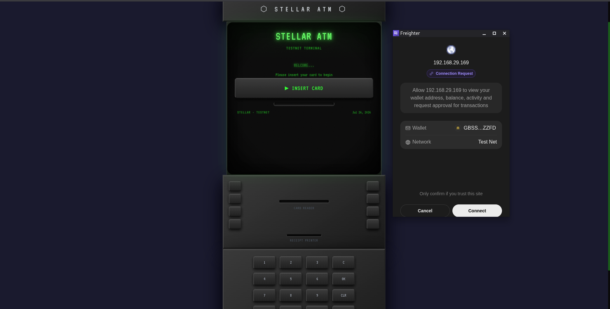
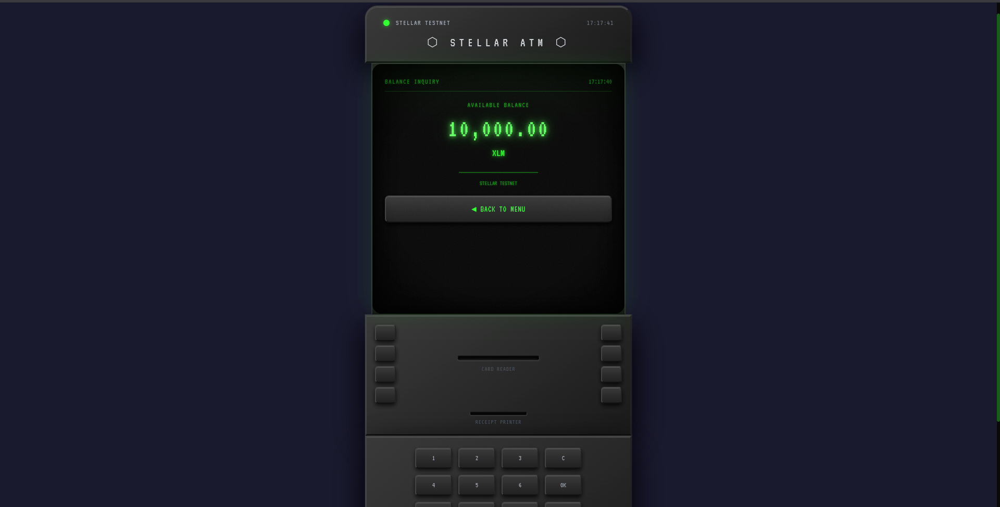
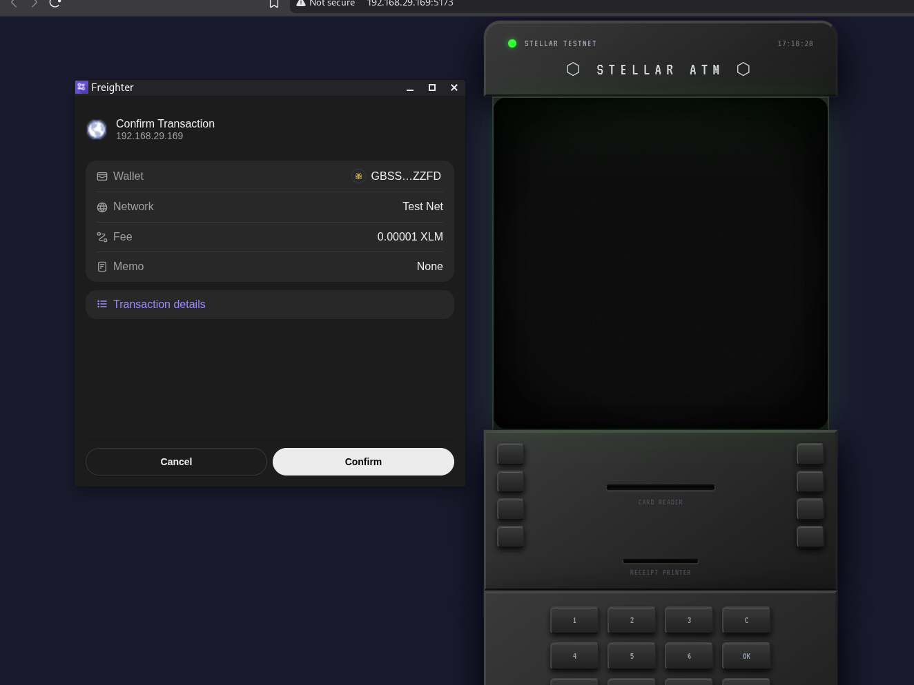
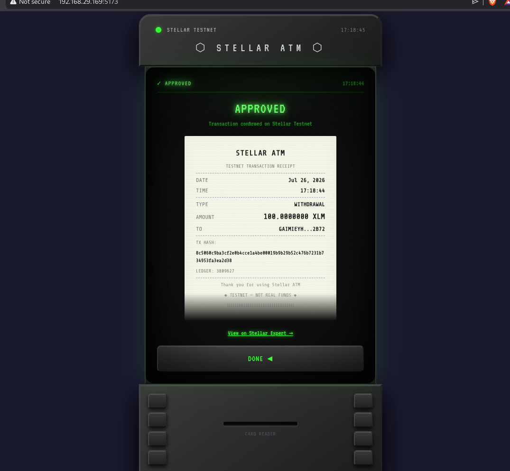

# Retro Terminal ATM — Stellar Testnet dApp

A retro CRT-styled ATM terminal dApp for the Stellar Testnet. Connect your Freighter wallet, check your XLM balance, and send payments — all through a satisfying old-school bank terminal interface with green phosphor glow, scanlines, and physical ATM chassis aesthetics.

Built for the Stellar Workshop "White Belt" submission.

## Features

- **Wallet Connection** — "Insert Card" / "Eject Card" flow via Freighter browser extension
- **Balance Inquiry** — Real-time XLM balance from Horizon testnet with PROCESSING animation
- **Friendbot Funding** — Auto-fund unfunded testnet accounts
- **Withdraw XLM** — Send real payment transactions to any Stellar address with confirmation flow
- **Printed Receipt** — Thermal-paper styled receipt with amount, destination, timestamp, tx hash, and Stellar Expert link
- **CRT Effects** — Scanlines, phosphor glow, flicker, screen curvature, noise texture
- **Physical ATM Chassis** — Rounded bezel, side buttons, numpad, card reader slot, receipt printer
- **Micro-interactions** — CSS-based beep feedback, button press animations, screen transitions

## Tech Stack

- React + Vite
- `@stellar/stellar-sdk` — Transaction building and Horizon queries
- `@stellar/freighter-api` — Wallet connection and transaction signing
- Tailwind CSS — Styling with custom CRT/phosphor theme
- Stellar Testnet Horizon (`https://horizon-testnet.stellar.org`)
- Friendbot (`https://friendbot.stellar.org`)

## Prerequisites

- [Node.js](https://nodejs.org/) v18+
- [Freighter](https://freighter.app/) browser extension installed
- Freighter configured for **Stellar Testnet**

## Local Setup

```bash
# Clone the repo
git clone <repo-url>
cd stellar-tip-splitter

# Install dependencies
npm install

# Start the dev server
npm run dev
```

Open [http://localhost:5173](http://localhost:5173) in your browser.

## Usage

1. **Idle Screen** — The ATM boots with a retro CRT animation. Click "INSERT CARD" to connect your Freighter wallet.
2. **Main Menu** — Choose between CHECK BALANCE or WITHDRAW XLM.
3. **Balance** — View your XLM balance in real-time. If your account is unfunded, use the Friendbot button to get testnet XLM.
4. **Withdraw** — Enter a destination Stellar address (G...) and amount. Confirm the transaction. Freighter will prompt you to sign.
5. **Receipt** — After a successful transaction, a thermal-paper receipt appears with all details and a link to view on Stellar Expert.

## Screenshots

### Wallet Connected State
<!-- Insert screenshot: main menu with card inserted indicator -->


### Balance Displayed
<!-- Insert screenshot: balance inquiry showing XLM amount -->


### Successful Testnet Transaction
<!-- Insert screenshot: receipt after a successful withdrawal -->


### Transaction Result on Stellar Expert
<!-- Insert screenshot: Stellar Expert explorer showing the transaction -->


## Project Structure

```
stellar-tip-splitter/
├── index.html
├── package.json
├── vite.config.js
├── tailwind.config.js
├── postcss.config.js
├── src/
│   ├── main.jsx
│   ├── App.jsx              # Screen state machine
│   ├── index.css             # CRT effects, scanlines, phosphor glow
│   ├── lib/
│   │   └── stellar.js        # Freighter + Horizon + payment logic
│   └── components/
│       ├── AtmChassis.jsx    # Physical ATM frame + numpad
│       ├── BootScreen.jsx    # Boot sequence animation
│       ├── IdleScreen.jsx    # Welcome / insert card screen
│       ├── MenuScreen.jsx    # Main menu with options
│       ├── BalanceScreen.jsx # Balance inquiry with processing state
│       ├── WithdrawScreen.jsx# Withdrawal flow (input → confirm → processing)
│       ├── FundingScreen.jsx # Friendbot funding animation
│       ├── ReceiptScreen.jsx # Thermal paper receipt
│       └── ErrorScreen.jsx   # Error/declined screen
└── screenshots/
    ├── wallet-connected.png
    ├── balance-displayed.png
    ├── transaction-success.png
    └── transaction-result.png
```

## Disclaimer

This application operates on the **Stellar Testnet** only. No real funds are involved. The ATM aesthetic is purely visual — all transactions are real testnet Stellar transactions signed through Freighter.

## License

MIT
